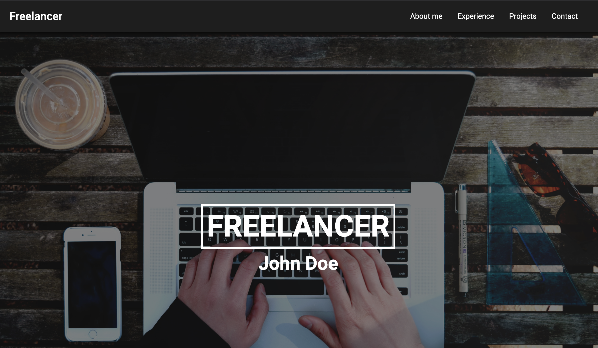

# Freelancer Theme

Website template designed to show experience and portfolio. 

The website was created in HTML, SCSS and JS. 

The website has 6 main sections:
- Navigation - always visible on top of the screen
- Cover - with a full screen image and space for a title and subtitle
- About me - with a space for a description and a photo of the user
- Experience - with a timeline dedicated to describing the experience
- Projects - with tabs styled as a terminal window
- Contact - with links to social media and an email to the owner.

Each section should display correctly on:
- Dekstop
- Tablet
- Mobile

## How to run:

`npm install -g gulp-cli`

`npm install`

`gulp`
